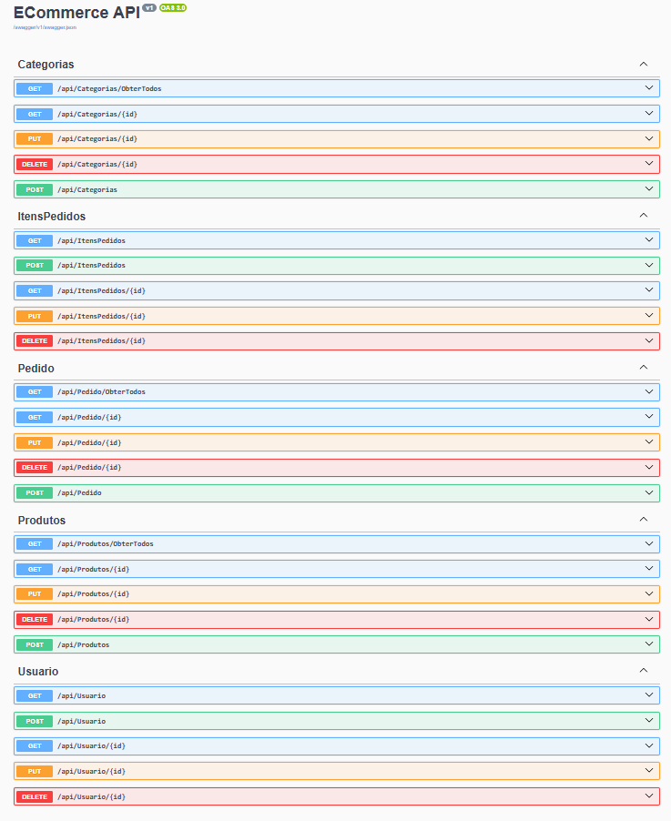

# EcommerceApi




> API de e-commerce especializada em produtos infantis, incluindo roupas, brinquedos e acessórios. Este projeto visa facilitar a gestão de um e-commerce, oferecendo funcionalidades como controle de estoque, gerenciamento de pedidos e autenticação de usuários.

### Ajustes e melhorias

O projeto ainda está em desenvolvimento e as próximas atualizações serão voltadas para as seguintes tarefas:

- [x] CRUD completo de produtos, categorias, pedido, itensPedidos e usuários. 
- [x] Implementação da autenticação de usuários e armazenamento seguro de senhas.
- [x] Sistema de relacionamento entre produtos e categorias.
- [ ] Implementação do carrinho de compras.
- [ ] Integração com sistema de pagamento externo.
- [ ] Configuração de alertas de estoque baixo via e-mail.
- [ ] Relatórios de vendas e estoque.
- [ ] Iniciar o frontend utilizando o Angular.

## 💻 Pré-requisitos

Antes de começar, verifique se você atendeu aos seguintes requisitos:

- Você instalou a versão mais recente de `<.Net8 / SQLSERVER>`
- Você tem uma máquina `<Windows / Linux / Mac>`. 
- Você leu `<ReadMe.md>`.

## 🚀 Instalando <EcommerceApi>

Para instalar o <EcommerceApi>, siga estas etapas:

Linux e macOS:

```
dotnet restore
dotnet build
```

Windows:

```
dotnet restore
dotnet build
```

## ☕ Usando <EcommerceApi>

Para usar <EcommerceApi>, siga estas etapas:

```
dotnet run
```

Acesse a documentação Swagger em ```http://localhost:5000/swagger``` para explorar e testar os endpoints da API, como:

-Produtos: /api/produtos
-Categorias: /api/categorias
-Pedidos: /api/pedidos
-Autenticação: /api/usuarios
-Itens do pedido: /api/itenspedidos

## 😄 Seja um dos contribuidores

Quer fazer parte desse projeto? Clique [AQUI](CONTRIBUTING.md) e leia como contribuir.

## 📝 Licença

Esse projeto está sob licença. Veja o arquivo [LICENÇA](LICENSE.md) para mais detalhes.
